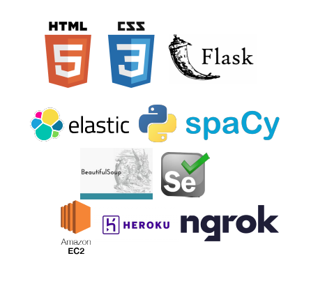

# Comic Search

[site of the project] (tbd)
###### Or how to create a newsletter sending technical interview questions and preparation tips in order to learn more about flask, nosql, web hosting and data structure.
## TLDR:
 In order to find a real life application to nosql (elastic search) and gain experience with python for the web (flask), I coded this application that enables you to search a comic book by title or plot along with related anime, manga and movies and then get a link to buy it

## Goals
- [x] Learn to use flask to create a website
- [x] Learn how to use elastic search to store, organize and query content
- [x] Using scrapping to get data and create datasets on the related subjects
- [ ] Using NLP to create a recommendation system for related contents
- [ ] Learn how to host a website on the cloud (firebase, aws, gcp…)
- [ ] Learn how to add amazon affiliate links

## Tech/Frameworks used:
- [flask](https://flask.palletsprojects.com/en/1.1.x/)
- [elastic search](https://www.mongodb.com/)
- [python](https://www.python.org/)
- [pandas](https://pandas.pydata.org/)
- [beautifulsoup](https://www.crummy.com/software/BeautifulSoup/)
- [selenium](https://selenium-python.readthedocs.io/)
- [cfscrape](https://selenium-python.readthedocs.io/) (broken for now)

## Use Cases:
- [x] Connect to the site and send data for a search
- [x] After the search is done, do an additional research by (genres, publisher, writers, artist)
## Logs
## Conclusion

## References:
* https://www.w3schools.com/python/python_mongodb_getstarted.asp

